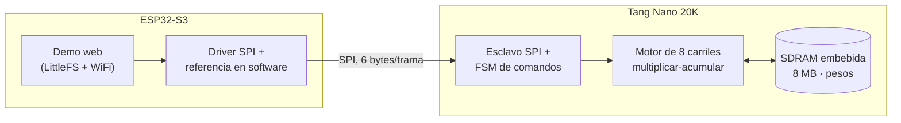

# fpga_NPU_poc

Acelerador de redes neuronales (NPU) implementado sobre una FPGA **Sipeed Tang
Nano 20K** (Gowin GW2AR-LV18QN88C8/I7), controlado por un **ESP32-S3** vía
SPI. Ejecuta redes densas (fully-connected) cuantizadas en int8, configurables
de punta a punta por SPI — cantidad de capas, anchos, pesos, bias y
parámetros de cuantización — sin recompilar el hardware.

Incluye tres demos funcionando de punta a punta, cada una con su propio
modelo entrenado con TensorFlow/Keras:

| Demo | Tarea | Modelo | Precisión |
|---|---|---|---|
| Dígitos | Clasificar un dígito dibujado (MNIST) | `784→128→64→10` | 100% (300/300) |
| Palabras clave | Reconocer palabras dichas por voz, entrenable con tus propias grabaciones | `490→256→256→128→64→32→N` | ~97% |
| Gestos | Reconocer un gesto hecho con el celular ("varita mágica"), usando acelerómetro + giróscopo | `180→64→32→4` | 100% (4/4) |

## Arquitectura



El ESP32 configura la topología de la red y carga pesos/bias por SPI, manda
la entrada (imagen, características de audio o de movimiento ya procesadas),
dispara la inferencia y lee el resultado — comparándolo en vivo contra el
mismo modelo corriendo en software en el propio ESP32.

**Rendimiento medido** (FPGA vs. el mismo modelo en software en el ESP32):

| Métrica | Valor |
|---|---|
| Motor de streaming de pesos (SDRAM, ráfaga nativa) | 3,15× — 6,14 ms/inferencia |
| Demo de dígitos | 4,88× — 2,88 ms (FPGA) vs 14,06 ms (ESP32) |
| Demo de gestos | 2,78× — 0,39 ms (FPGA) vs 1,07 ms (ESP32) |

La ventaja de la FPGA crece con el tamaño del modelo: para redes muy chicas
el overhead fijo de una trama SPI hace que el ESP32 gane; a partir de unos
pocos miles de pesos, la FPGA pasa a ganar con margen creciente.

## Estructura del repositorio

```
fpga_project/    Verilog de la NPU (proyecto Gowin IDE).
                 src/04_sdram_pesos/ es la version vigente (top_sdram_p3.v).
                 Las carpetas 00_comun/ a 03_mlp_paralelo/ documentan,
                 cada una con su propio README, las etapas previas del diseño.

esp32/           Firmware del ESP32-S3 (framework Arduino / PlatformIO).
                 04_sdram_pesos/{mnist,kws,gesture}_npu_poc/ son las tres
                 demos activas, cada una con su sketch y su pagina web.

tools/           Scripts de Python para entrenar y exportar modelos
                 (tools/train_*.py) al formato binario que lee el firmware.

docs/            Curso de Verilog para la Tang Nano 20K, de cero a esta NPU
                 (ver mas abajo).
```

## Empezar

### Requisitos

- **Gowin IDE** (síntesis, place & route y programador para la FPGA).
- **PlatformIO** con soporte para el framework Arduino / ESP32.
- **Python 3** con TensorFlow/Keras, para entrenar o reentrenar modelos.
- Opcional: **Icarus Verilog + GTKWave**, para simular sin usar la placa.

### Compilar y grabar la FPGA

```bash
gw_sh.exe fpga_project/build.tcl

# grabar en RAM (volátil, para probar sin comprometer nada):
programmer_cli.exe --device GW2AR-18C --operation_index 2 \
  --fsFile fpga_project/impl/pnr/fpga_project.fs

# grabar en flash (permanente, sobrevive a reinicios):
programmer_cli.exe --device GW2AR-18C --operation_index 9 \
  --fsFile fpga_project/impl/pnr/fpga_project.fs
```

### Compilar y subir el firmware del ESP32

Cada demo vive en su propia carpeta bajo `esp32/04_sdram_pesos/`. Copiá el
contenido de la demo elegida a un proyecto de PlatformIO para la placa
correspondiente y corré:

```bash
pio run -t upload                  # firmware
pio run -t uploadfs                # modelo (model.bin/test.bin) + pagina web
```

Al arrancar, el ESP32 se conecta a la red WiFi configurada, corre un
benchmark contra un set de prueba, y sirve la demo web por su IP.

### Entrenar o reentrenar un modelo

```bash
python tools/train_mnist_npu.py        # dígitos (MNIST)
python tools/train_kws_npu.py          # palabras clave (dataset público)
python tools/train_one_word_npu.py     # palabras clave con tu propia voz
python tools/train_gestures_npu.py     # gestos con el celular
```

Cada script cuantiza el modelo entrenado a int8 (estilo TFLite, per-tensor),
reordena los pesos al layout que espera el motor de streaming, y exporta
`model.bin`/`test.bin` al directorio `data/` de la demo correspondiente,
listos para subir con `pio run -t uploadfs`.

### Usar la demo web

Con el firmware corriendo, abrí la IP del ESP32 desde el navegador. Las
demos de palabras clave y gestos usan el micrófono / los sensores de
movimiento del navegador, que algunos navegadores solo habilitan en HTTPS —
si accedés por `http://<ip>` puede hacer falta marcar ese origen como
seguro en la configuración del navegador.

## Límites del hardware actual

| Límite | Valor |
|---|---|
| Tipo de capa soportada | solo densas (fully-connected) |
| Capas máximas | 8 |
| Entradas máximas (capa 0) | 1024 |
| Neuronas máximas por capa | 256 |
| Bias totales | 2048 |
| Memoria de pesos | hasta ~8 MB (SDRAM embebida) |
| Aritmética | int8, cuantización per-tensor estilo TFLite |

## Curso de Verilog: de compuertas lógicas a esta NPU

[`docs/curso-verilog-fpga.html`](docs/curso-verilog-fpga.html) es un curso
autocontenido, pensado para alguien que nunca escribió Verilog, que enseña
—tema por tema, con ejercicios— todo lo necesario para entender y extender
este proyecto: compuertas y biestables, cómo simular y programar la Tang
Nano 20K, máquinas de estado, los protocolos UART/I2C/SPI, memoria BRAM y
SDRAM, y por último cómo se combina todo en la NPU real de este
repositorio. Se abre directamente en el navegador.

## Qué no está versionado

Ver [`.gitignore`](.gitignore): grabaciones de voz y de movimiento
personales, cachés de entrenamiento, modelos exportados (`model.bin`/
`test.bin`) y artefactos de compilación del Gowin IDE — todos regenerables
con los scripts de `tools/` o con una recompilación, así que se quedan
fuera del control de versiones.
